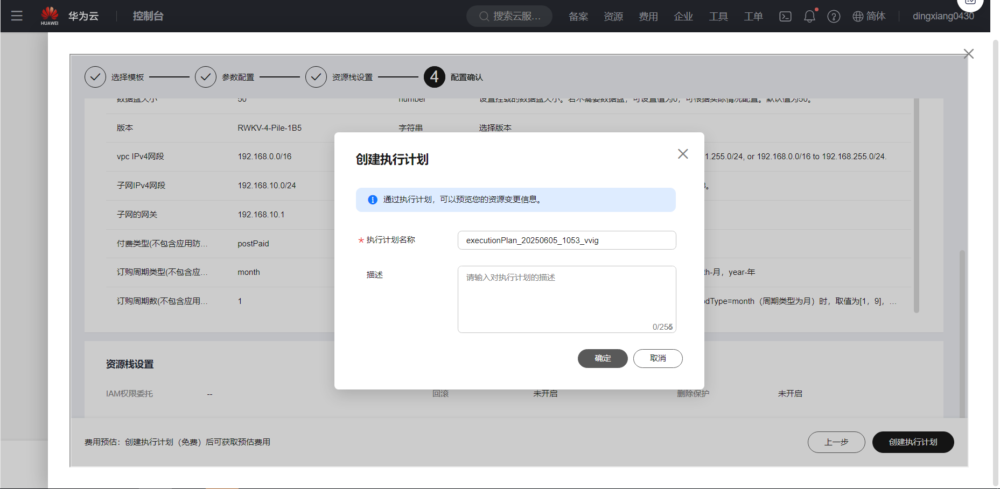
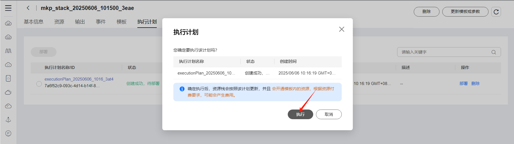
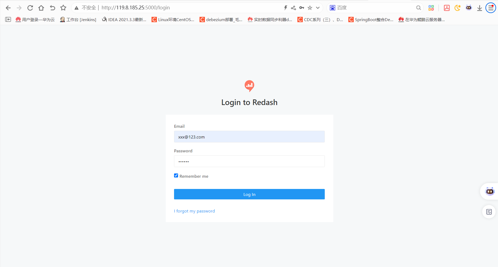
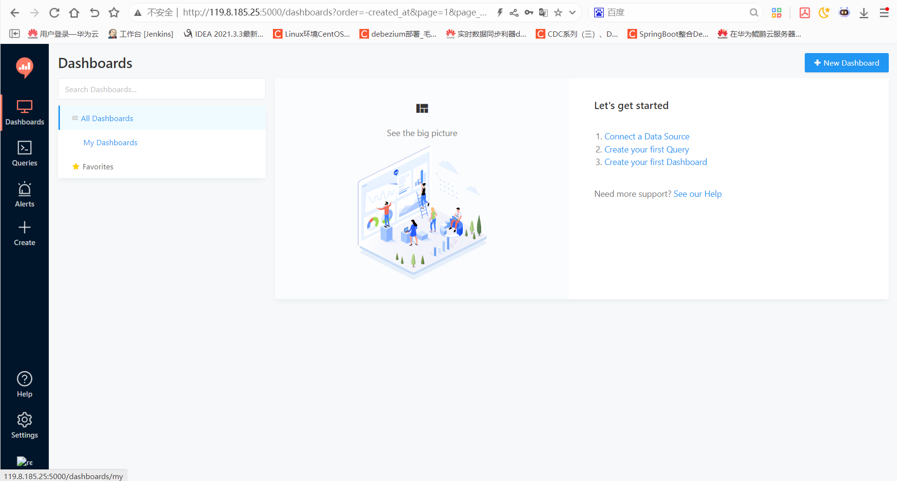

# redash数据查询与可视化工具使用指南

# 一、商品链接

[redash数据查询与可视化工具](https://marketplace.huaweicloud.com/contents/1c70adbb-d0fc-4572-891e-7112bfc165c0#productid=OFFI1129684441106587648)

# 二、商品说明

**redash** 是一款免费开源的数据可视化与协作工具，可以帮助用户快速连接数据源、编写查询、生成图表并构建交互式仪表盘。它简化了数据探索和共享的过程，尤其适合需要团队协作的数据分析场景。

# 三、商品购买

您可以在云商店搜索 **redash数据查询与可视化工具**。

其中，地域、规格、推荐配置使用默认，购买方式根据您的需求选择按需/按月/按年，短期使用推荐按需，长期使用推荐按月/按年，确认配置后点击“立即购买”。

## 3.1 使用 RFS 模板直接部署

必填项填写后，点击 下一步

创建直接计划后，点击 确定

点击部署，执行计划

如下图“Apply required resource success. ”即为资源创建完成

# 3.2ECS 控制台配置

### 准备工作

在使用ECS控制台配置前，需要您提前配置好 **安全组规则**。

> **安全组规则的配置如下：**
> - 入方向规则放通端口5000，源地址内必须包含您的客户端ip，否则无法访问
> - 入方向规则放通 CloudShell 连接实例使用的端口 `22`，以便在控制台登录调试
> - 出方向规则一键放通

### 创建ECS

前提工作准备好后，选择 ECS 控制台配置跳转到[购买ECS](https://support.huaweicloud.com/qs-ecs/ecs_01_0103.html) 页面，ECS 资源的配置如下图所示：

选择CPU架构

选择服务器规格

选择镜像

其他参数根据实际请客进行填写，填写完成之后，点击立即购买即可

> **值得注意的是：**
- VPC 您可以自行创建
- 安全组选择 [**准备工作**](#准备工作) 中配置的安全组；
- 弹性公网IP选择现在购买，推荐选择“按流量计费”，带宽大小可设置为5Mbit/s；
- 高级配置需要在高级选项支持注入自定义数据，所以登录凭证不能选择“密码”，选择创建后设置；
- 其余默认或按规则填写即可。

# 商品使用

## IP+5000访问UI
默认【邮箱：xxx@123.com 密码：redash】登录进去之后可自行修改

### 参考文档
[redash官网](https://redash.io/)
